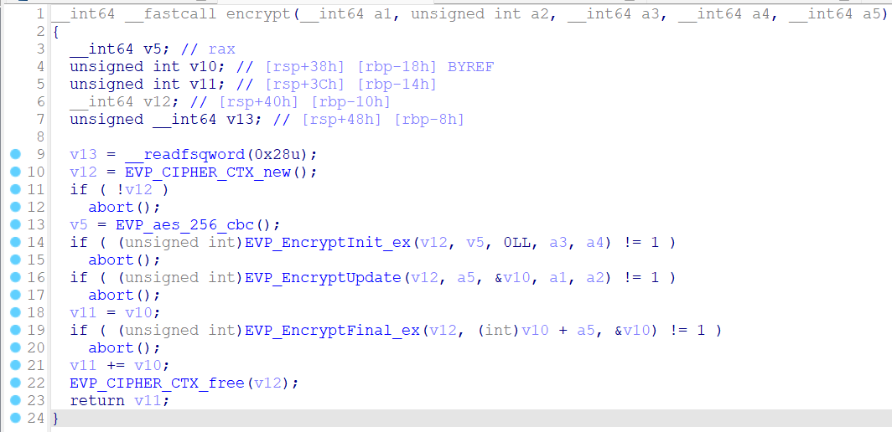

# function main


# function encrypt




# rev_upgraded.c
```c
#include <stdio.h>
#include <string.h>
#include <stdlib.h>
#include <openssl/evp.h>

unsigned char key[] = { 0x99, 0x82, 0x56, 0x34, 0xc4, 0xa9, 0x6c, 0x53, 0x4f, 0xf6, 0x78, 0x93,
                        0x4d, 0x9c, 0x2a, 0xd7, 0xde, 0x2e, 0x9b, 0xfb, 0x1b, 0xc3, 0x9c, 0x00,
                        0xbc, 0xf9, 0x2d, 0x65, 0x82, 0x2e, 0xe4, 0x45, 0x4f, 0x37, 0xfe, 0x8b,
                        0x2e, 0x0c, 0x69, 0xab, 0xfe, 0x11, 0x3b, 0xa7, 0x52, 0x8d, 0xc7, 0xe8,
                        0x8e, 0xca, 0x91, 0x65, 0xc0, 0xa1, 0x3e, 0x30, 0x77, 0x4f, 0x43, 0xd1,
                        0xcb, 0xfb, 0x78, 0xf3, 0x98, 0x6a, 0xae, 0x4d, 0xd2, 0x66, 0x80, 0x49,
                        0x35, 0xbc, 0xd3, 0xdc };

unsigned char iv[] = { 0x6b, 0xd5, 0x52, 0x77, 0x6f, 0x06, 0x81, 0xf3, 0x95, 0xb3, 0x04, 0xfd,
                        0xe5, 0x84, 0x23, 0xfe, 0xff, 0x03, 0xf2, 0x9e, 0x49, 0x87, 0xe5, 0x7c,
                        0x33, 0xa2, 0x3b, 0x52, 0xa3, 0xdf, 0x62, 0xa8, 0xc0, 0x47, 0x9c, 0xa9,
                        0xb6, 0x2f, 0x53, 0x8b, 0x00 };

unsigned char ciphertext[] = { 0xff, 0x25, 0xb1, 0xd7, 0xad, 0xe8, 0xcd, 0x36, 0xbd, 0x7d, 0x09,
                                0xa6, 0x1f, 0xf9, 0xc1, 0xc1, 0xad, 0x38, 0xce, 0x29, 0x3d, 0x84,
                                0xcb, 0xe5, 0x83, 0x9f, 0xb6, 0x61, 0xbe, 0xb7, 0xea, 0x4f, 0x76,
                                0x5d, 0x2d, 0xc4, 0x4e, 0x2d, 0xa6, 0x70, 0xdc, 0x04, 0xe3, 0xe6,
                                0xbb, 0xc1, 0x85, 0x21 };

int ciphertextLength = 48;

int main(void) {

    EVP_CIPHER_CTX* ctx = EVP_CIPHER_CTX_new();
    EVP_DecryptInit_ex(ctx, EVP_aes_256_cbc(), NULL, key, iv);
    unsigned char* plaintext = (unsigned char*)malloc(sizeof(unsigned char) * ciphertextLength);
    int length;
    EVP_DecryptUpdate(ctx, plaintext, &length, ciphertext, ciphertextLength);
    int plaintextLength = length;
    EVP_DecryptFinal_ex(ctx, plaintext + plaintextLength, &length);
    plaintextLength += length;
    printf("Plaintext: "); 
    for (int i = 0; i < plaintextLength; i++) 
    { 
        printf("%c", plaintext[i]); 
    } 
    printf("\n");
    return 0;
}
```
***
**gcc rev_upgraded.c -lcrypto -o rev_upgraded**

***

# **FLAG**

**`HTB{h4rdc0d1ng_k3ys?r00k13_m15t4k3!}`**


 
