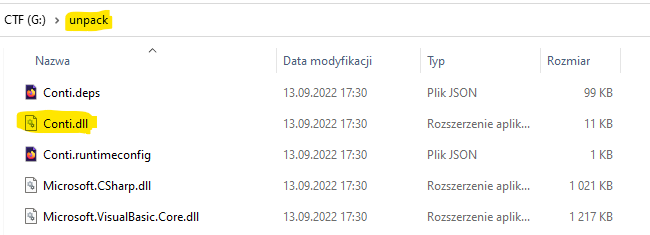
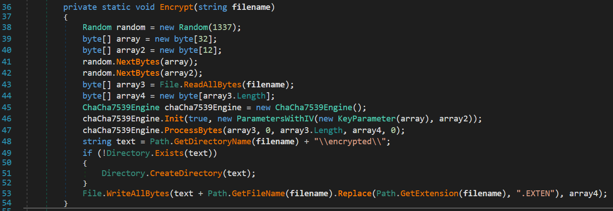
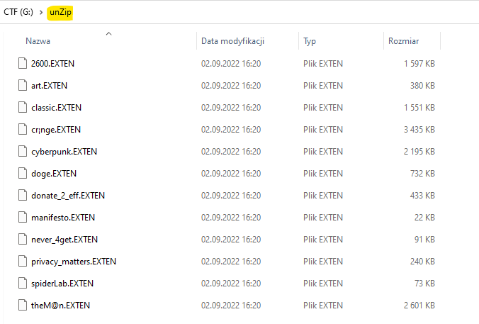
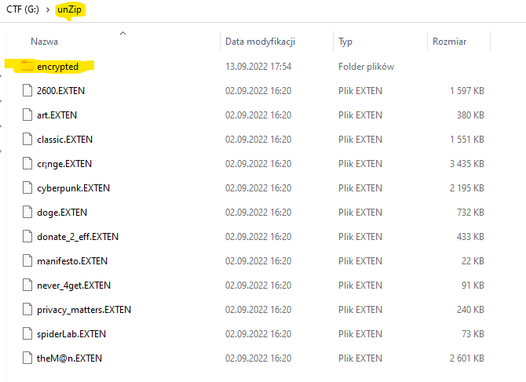
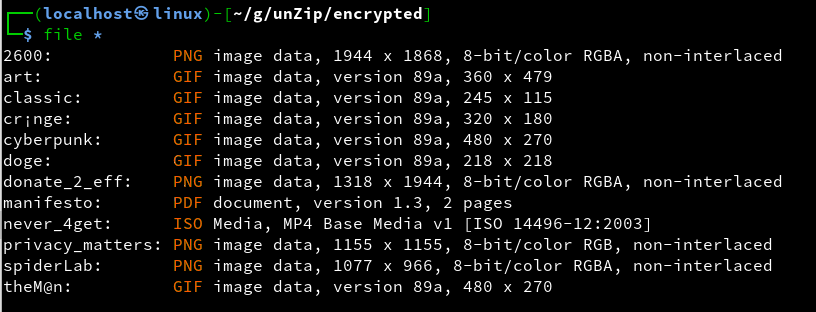

# Windows Terminal

```ps
sfextract.exe Conti.exe -o unpack
```




# dnSpy-net-win64




# unzip encryptedFiles.zip



# Program.cs

```c#
using System;
using System.IO;
using Org.BouncyCastle.Crypto.Engines;
using Org.BouncyCastle.Crypto.Parameters;

namespace test_enc
{
    class Program
    {
        private static void Dcrypt(string filename)
        {
            Random random = new Random(1337);
            byte[] array = new byte[32];
            byte[] array2 = new byte[12];
            random.NextBytes(array);
            random.NextBytes(array2);
            byte[] array3 = File.ReadAllBytes(filename);
            byte[] array4 = new byte[array3.Length];
            ChaCha7539Engine chaCha7539Engine = new ChaCha7539Engine();
            chaCha7539Engine.Init(false, new ParametersWithIV(new KeyParameter(array), array2));
            chaCha7539Engine.ProcessBytes(array3, 0, array3.Length, array4, 0);
            string text = Path.GetDirectoryName(filename) + "\\encrypted\\";
            if (!Directory.Exists(text))
            {
                Directory.CreateDirectory(text);
            }
            File.WriteAllBytes(text + Path.GetFileName(filename).Replace(Path.GetExtension(filename), ""), array4);
        }

        static void Main(string[] args)
        {
            string sourceDirectory = @"G:\unZip";

            try
            {
                var txtFiles = Directory.EnumerateFiles(sourceDirectory, "*.EXTEN");

                foreach (string currentFile in txtFiles)
                {
                    string fileName = currentFile.Substring(sourceDirectory.Length + 1);
                    Dcrypt(sourceDirectory + "\\" + fileName);
                    Console.WriteLine(sourceDirectory + "\\" + fileName);
                }
            }
            catch (Exception e)
            {
                Console.WriteLine(e.Message);
            }
        }
    }
}
```






# mv manifesto manifesto.pdf

# FLAG

**`flag{Cyb3r_Pun4_!$_n0W1}`**


