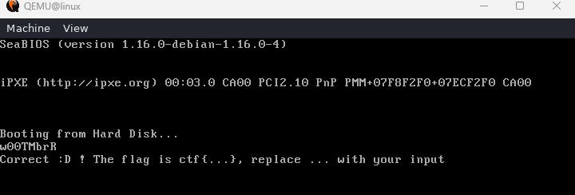

# oldschool.nasm

```asm
BITS 64
section .text 

global fun

fun:
    xor rcx, rcx
    mov rsi, rdi
    xor rdi, rdi
    xor rax, rax
    xor rbx, rbx
    xor rdx, rdx
    mov r8, 1
loc_17C29:
    cmp rcx, 4
    jz  loc_17CF0
    mov rdi, rcx
    shl rdi, 1
    add rdi, rsi
    mov rax, [rdi]
    mov rdx, [rsi+4]
    mov rdi, [rsi+6]
    cmp rcx, 0
    jnz loc_17C48
    mov rbx, [rsi+2]
    jmp loc_17C5E
loc_17C48:
    mov rbx, [rsi]
    cmp rcx, 1
    jnz loc_17C51
    jmp loc_17C5E
loc_17C51:
    mov rdx, [rsi+2]
    cmp rcx, 2
    jnz loc_17C5B
    jmp loc_17C5E
loc_17C5B:
    mov rdi, [rsi+4]
loc_17C5E:
    rol ax, 8
    rol bx, 8
    rol dx, 8
    rol di, 8
    push    ax
    and ax, 0x0F0F
    cmp ax, 0x0D02
    jz  loc_17CBF
    cmp ax, 0x0700
    jz  loc_17C8C
    mov rax, [rsp]
    and ax, 0xFF
    cmp ax, 0x54
    jz  loc_17CA4
    and ax, 0Fh
    cmp al, 2
    jz  loc_17CD0
loc_17C8C:
    xor bx, dx
    xor bh, 0x0F
    and bx, 0xFF00
    and di, 0xFF00
    cmp bx, di
    jnz loc_17CE5
    cmp cl, 0
    jnz loc_17CE5
    jmp loc_17CEB
loc_17CA4:
    xor bx, dx
    rol bx, 1
    xor bx, 0xF0
    and bx, 0xF0F0
    and di, 0xF0F0
    cmp bx, di
    jnz loc_17CE5
    cmp cl, 1
    jnz loc_17CE5
    jmp loc_17CEB
loc_17CBF:
    xor bx, dx
    xor bx, 0x3536
    cmp bx, di
    jnz loc_17CE5
    cmp cl, 2
    jnz loc_17CE5
    jmp loc_17CEB
loc_17CD0:
    xor bx, dx
    and bx, 0xF0F0
    and di, 0xF0F0
    cmp bx, di
    jnz loc_17CE5
    cmp cl, 3
    jnz loc_17CE5
    jmp loc_17CEB
loc_17CE5:
    mov r8, 0
loc_17CEB:
    pop ax
    inc cx
    jmp loc_17C29
loc_17CF0:
    mov rax, r8
    ret
```

# nasm -felf64 oldschool.nasm -o oldschool.o

# oldschool.c

```c
#include <stdio.h>

int fun(char *);

int main(void){
    char nap[9];
    scanf("%s", nap);
    if(fun(nap)){
        printf("OK\n");
    }
    return 0;
}
```

# gcc -o oldschool.o -c oldschool.c

# gcc -o oldschool.o -c oldschool.c -no-pie

# oldschool.py

```py
import angr
import claripy

FLAG_LEN = 8
STDIN_FD = 0

base_addr = 0x400000

proj = angr.Project("./oldschool", main_opts={'base_addr': base_addr}) 

flag_chars = [claripy.BVS('flag_%d' % i, 8) for i in range(FLAG_LEN)]
flag = claripy.Concat( *flag_chars + [claripy.BVV(b'\n')])

state = proj.factory.full_init_state(
        args=['./oldschool'],
        stdin=angr.SimFileStream(name='stdin', content=flag, has_end=False)
)


for k in flag_chars:
    state.solver.add(k >= ord('!'))
    state.solver.add(k <= ord('~'))

simgr = proj.factory.simulation_manager(state)
find_addr  = 0x401290 # SUCCESS
avoid_addr = 0x40123F # FAILURE
simgr.explore(find=find_addr, avoid=avoid_addr)

if (len(simgr.found) > 0):
    for found in simgr.found:
        print(found.posix.dumps(STDIN_FD))
```

# Pass: w00TMbrR



# FLAG

**`ctf{w00TMbrR}`**


