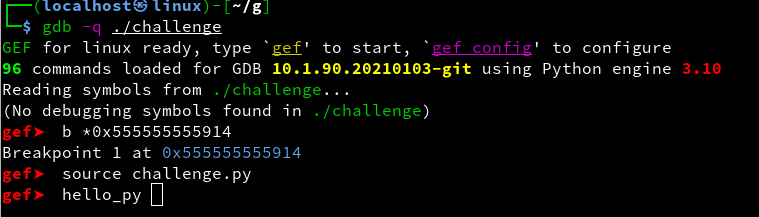
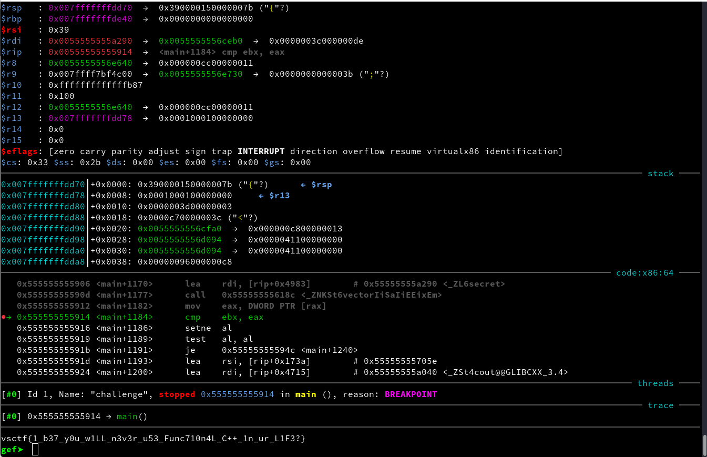

# challenge.py

```py
import gdb


class HelloPy(gdb.Command):
    def __init__(self):
        super(HelloPy, self).__init__('hello_py', gdb.COMMAND_USER)

    def invoke(self, _unicode_args, _from_tty):

        alf = '0123456789abcdefghijklmnopqrstuvwxyzABCDEFGHIJKLMNOPQRSTUVWXYZ_+?{}'

        # 0x555555555914 break

        w = 'AAAAAAAAAAAAAAAAAAAAAAAAAAAAAAAAAAAAAAAAAAAAAAAAAAAAAAAAAA'
        a = 0

        while a < 58:
            x = 0
            while True:
                ww = list(w)
                ww[a] = alf[x]
                gdb.execute(f"r <<< {''.join(ww)}")
                for i in range(a):
                    gdb.execute('c')

                if int(gdb.parse_and_eval("$rbx")) == int(gdb.parse_and_eval("$rax")):
                    w = ''.join(ww)
                    print(w)
                    a += 1
                    break
                x += 1

HelloPy()
```




# FLAG

**`vsctf{1_b37_y0u_w1LL_n3v3r_u53_Func710n4L_C++_1n_ur_L1F3?}`**


