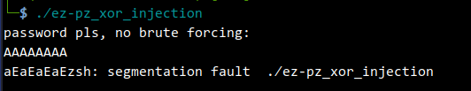
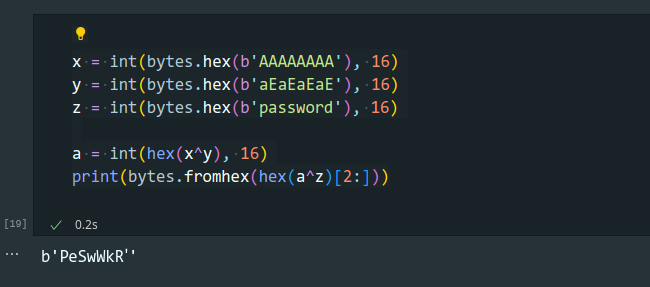
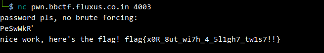

# ez-pz_xor_injection.py

```py
with open('./ez-pz xor', 'rb') as f:
    l = f.read()

l = list(l)

f.close()

"""
mov r8, rdi
mov rax, 1
mov rdi, 1
mov rsi, r8
mov rdx, 8
syscall

x = [0x49, 0x89, 0xf8, 0x48, 0xc7, 0xc0, 0x01, 0x00, 0x00, 0x00, 0x48, 0xc7, 0xc7, 0x01, 0x00, 0x00, 0x00, 0x4c, 0x89, 0xc6, 0x48, 0xc7, 0xc2, 0x08, 0x00, 0x00, 0x00, 0x0f,0x05]
"""

x = [0x49, 0x89, 0xf8, 0x48, 0xc7, 0xc0, 0x01, 0x00, 0x00, 0x00, 0x48, 0xc7, 0xc7, 0x01, 0x00, 0x00, 0x00, 0x4c, 0x89, 0xc6, 0x48, 0xc7, 0xc2, 0x08, 0x00, 0x00, 0x00, 0x0f,0x05]

x = list(x)

for i in range(len(x)):
    l[0x1385+i] = x[i]

with open('./ez-pz_xor_injection', 'wb') as f:
    f.write(bytes(l))
```







 
