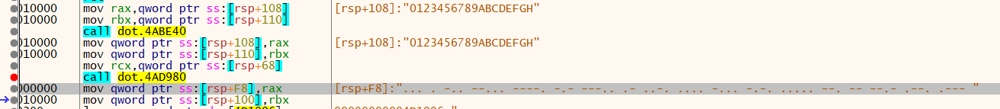

# solver.py

```py
l1 = '0123456789ABCDEFGHIJKLMNOPQRSTUVWXYZ'
l2 = 'SED79K8AFHBC5GMQPJ6LU_OT4IV1W0ZXY32R'

# ..... ... --- .. --.. ----- --... .---- --. ----- --.. -.-- --... _ ..... ... --- --...
x = '5SOIZ071G0ZY7_T5SO7'

for i in x:
    print(l1[l2.index(i)], end='')

# C0MPUT3RDTUW3LC0M3
```


# FLAG

**`ISITDTU{C0MPUT3RDTUW3LC0M3}`**


