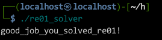

# fun.nasm

```fun.nasm
BITS 64
section .text 

global fun

fun:
        push   rbp
        mov    rbp, rsp
        sub    rsp, 0x20
        mov    DWORD [rbp-0x4], edi
        mov    DWORD [rbp-0x8], esi
        mov    QWORD [rbp-0x10], rdx
        mov    DWORD [rbp-0x14], ecx
        mov    DWORD [rbp-0x18], r8d
        mov    QWORD [rbp-0x20], r9
        mov    eax, DWORD [a1]
        cmp    DWORD [rbp-0x4], eax
        jle    L1
        mov    eax, DWORD [a2]
        cmp    DWORD [rbp-0x18], eax
        jle    L2
        mov    eax, DWORD [a3]
        cmp    DWORD [rbp-0x8], eax
        jle    L3
        mov    eax, DWORD [a1]
        movsxd rdx, eax
        mov    rax, rdx
        shl    rax, 0x2
        add    rax, rdx
        shl    rax, 0x2
        mov    rdx, rax
        mov    rax, QWORD [rbp+0x10]
        add    rdx, rax
        mov    eax, DWORD [a2]
        cdqe
        mov    esi, DWORD [rdx+rax*4]
        mov    eax, DWORD [a1]
        movsxd rdx, eax
        mov    rax, rdx
        shl    rax, 0x2
        add    rax, rdx
        shl    rax, 0x2
        mov    rdx, rax
        mov    rax, QWORD [rbp-0x10]
        add    rdx, rax
        mov    eax, DWORD [a3]
        cdqe
        mov    ecx, DWORD [rdx+rax*4]
        mov    eax, DWORD [a3]
        movsxd rdx, eax
        mov    rax, rdx
        shl    rax, 0x2
        add    rax, rdx
        shl    rax, 0x2
        mov    rdx, rax
        mov    rax, QWORD [rbp-0x20]
        add    rdx, rax
        mov    eax, DWORD [a2]
        cdqe
        mov    eax, DWORD [rdx+rax*4]
        imul   ecx, eax
        mov    eax, DWORD [a1]
        movsxd rdx, eax
        mov    rax, rdx
        shl    rax, 0x2
        add    rax, rdx
        shl    rax, 0x2
        mov    rdx, rax
        mov    rax, QWORD [rbp+0x10]
        add    rdx, rax
        mov    eax, DWORD [a2]
        add    ecx, esi
        cdqe
        mov    DWORD [rdx+rax*4], ecx
        mov    eax, DWORD [a3]
        add    eax, 0x1
        mov    DWORD [a3], eax
        mov    r8, QWORD [rbp-0x20]
        mov    edi, DWORD [rbp-0x18]
        mov    ecx, DWORD [rbp-0x14]
        mov    rdx, QWORD [rbp-0x10]
        mov    esi, DWORD [rbp-0x8]
        mov    eax, DWORD [rbp-0x4]
        sub    rsp, 0x8
        push   QWORD [rbp+0x10]
        mov    r9, r8
        mov    r8d, edi
        mov    edi, eax
        call   fun
        add    rsp, 0x10
L3:	    mov    DWORD [a3], 0x0
        mov    eax, DWORD [a2]
        add    eax, 0x1
        mov    DWORD [a2], eax
        mov    r8, QWORD [rbp-0x20]
        mov    edi, DWORD [rbp-0x18]
        mov    ecx, DWORD [rbp-0x14]
        mov    rdx, QWORD [rbp-0x10]
        mov    esi, DWORD [rbp-0x8]
        mov    eax, DWORD [rbp-0x4]
        sub    rsp, 0x8
        push   QWORD [rbp+0x10]
        mov    r9, r8
        mov    r8d, edi
        mov    edi, eax
        call   fun
        add    rsp,0x10
L2:	    mov    DWORD [a2], 0x0
        mov    eax, DWORD [a1]
        add    eax, 0x1
        mov    DWORD [a1], eax
        mov    r8, QWORD [rbp-0x20]
        mov    edi, DWORD [rbp-0x18]
        mov    ecx, DWORD [rbp-0x14]
        mov    rdx, QWORD [rbp-0x10]
        mov    esi, DWORD [rbp-0x8]
        mov    eax, DWORD [rbp-0x4]
        sub    rsp, 0x8
        push   QWORD [rbp+0x10]
        mov    r9, r8
        mov    r8d, edi
        mov    edi, eax
        call   fun
        add    rsp, 0x10
        jmp    L4
L1:	    nop
L4:	    leave
        ret

section .data
a1  dd   0
a2  dd   0
a3  dd   0

section .note.GNU-stack
```

# re01_solver.c

```c

#include <stdio.h>

extern int fun(int a1, int a2, int *a3, int a4, int a5, int *a6, int *a7);

int v12[] = {17325, 19708, 21160, 23202, 25884, 18561, 20995, 22495, 24643, 27473,
             18886, 21391, 22901, 25137, 28011, 17116, 19472, 20908, 22968, 25672,
              8035, 9333, 10185, 11405, 13119};
int v14[] = {0x02, 0x03, 0x05, 0x07, 0x0b, 0x0d, 0x11, 0x13, 0x17, 0x1d, 0x1f,
              0x25, 0x29, 0x2b, 0x2f, 0x35, 0x3b, 0x3d, 0x43, 0x47, 0x49, 0x4f,
               0x53, 0x59, 0x61};

int main(void)
{
    int a, b, c, d, e, x = 0;

    unsigned long long a1 = 0x404030;
    unsigned long long a2 = 0x404034;
    unsigned long long a3 = 0x404038;

    int alf[] = {0x61, 0x62, 0x63, 0x64, 0x65, 0x66, 0x67, 0x68, 0x69, 0x6a, 0x6b, 0x6c, 0x6d, 0x6e, 0x6f, 0x70,
                  0x71, 0x72, 0x73, 0x74, 0x75, 0x76, 0x77, 0x78, 0x79, 0x7a, 0x30, 0x31, 0x32, 0x33, 0x34, 0x35,
                   0x36, 0x37, 0x38, 0x39, 0x21, 0x5f};

run:
    if (x > 25)
        return 0;
    for (a = 0; a < 38; a++)
    {
        for (b = 0; b < 38; b++)
        {
            for (c = 0; c < 38; c++)
            {
                for (d = 0; d < 38; d++)
                {
                    for (e = 0; e < 38; e++)
                    {
                        int tmp[26] = {0};
                        int v18[26] = {0};
                        tmp[0 + x] = alf[a];
                        tmp[1 + x] = alf[b];
                        tmp[2 + x] = alf[c];
                        tmp[3 + x] = alf[d];
                        tmp[4 + x] = alf[e];

                        asm volatile(
                            "movq $0, %0\n\t" // Wyzerowanie a1
                            "movq $0, %1\n\t" // Wyzerowanie a2
                            "movq $0, %2"     // Wyzerowanie a3
                            :
                            : "m"(*(unsigned long long *)a1), "m"(*(unsigned long long *)a2), "m"(*(unsigned long long *)a3)
                            : "memory");

                        fun(5, 5, tmp, 5, 5, v14, v18);

                        if (v18[0 + x] == v12[0 + x])
                            if (v18[1 + x] == v12[1 + x])
                                if (v18[2 + x] == v12[2 + x])
                                    if (v18[3 + x] == v12[3 + x])
                                        if (v18[4 + x] == v12[4 + x])

                                        {
                                            printf("%c%c%c%c%c", alf[a], alf[b], alf[c], alf[d], alf[e]);
                                            x += 5;
                                            goto run;
                                        }
                    }
                }
            }
        }
    }
    return 0;
}

// good_job_you_solved_re01!
```

##### nasm -felf64 fun.nasm -o fun.o
##### gcc -o re01_solver.o -c re01_solver.c
##### gcc fun.o re01_solver.o -o re01_solver -no-pie



# FLAG

**`ISITDTU{good_job_you_solved_re01!}`**


