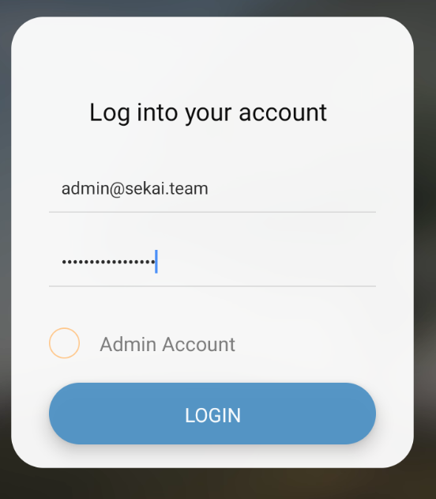
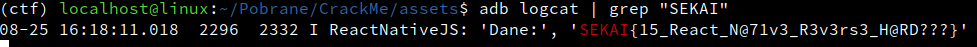

##### java -jar apktool_2.9.3.jar d CrackMe.apk

##### npx react-native-decompiler -i ./CrackMe/assets/index.android.bundle -o ./output

##### cd ./CrackMe/assets/output/

##### grep -lr "@sekai.team" .

```log
./456.js
./443.js
./null.cache
```

##### cat 456.js 

```
var _ = {
  LOGIN: 'LOGIN',
  EMAIL_PLACEHOLDER: 'user@sekai.team',
  PASSWORD_PLACEHOLDER: 'password',
  BEGIN: 'CRACKME',
  SIGNUP: 'SIGN UP',
  LOGOUT: 'LOGOUT',
  KEY: 'react_native_expo_version_47.0.0',
  IV: '__sekaictf2023__',
};
exports.default = _;
```

##### cat 443.js

```
...
     if ('admin@sekai.team' !== t.state.email || false === e.validatePassword(t.state.password))
        console.log('Not an admin account.');
     else console.log('You are an admin...This could be useful.');

...

...
    e.validatePassword = function (e) {
      if (17 !== e.length) return false;
      var t = module700.default.enc.Utf8.parse(module456.default.KEY),
        n = module700.default.enc.Utf8.parse(module456.default.IV);
      return (
        '03afaa672ff078c63d5bdb0ea08be12b09ea53ea822cd2acef36da5b279b9524' ===
        module700.default.AES.encrypt(e, t, {
          iv: n,
        }).ciphertext.toString(module700.default.enc.Hex)
      );
    };
...
```

##### decode_pass.py

```py
from Crypto.Cipher import AES
from binascii import unhexlify

def decrypt_password(ciphertext_hex, key, iv):
    ciphertext = unhexlify(ciphertext_hex)
    cipher = AES.new(key.encode('utf-8'), AES.MODE_CBC, iv.encode('utf-8'))
    decrypted = cipher.decrypt(ciphertext)
    decrypted = decrypted.rstrip(b"\0")
    
    return decrypted.decode('utf-8')

encrypted_password = '03afaa672ff078c63d5bdb0ea08be12b09ea53ea822cd2acef36da5b279b9524'
key = 'react_native_expo_version_47.0.0'
iv = '__sekaictf2023__'

decrypted_password = decrypt_password(encrypted_password, key, iv)
print(decrypted_password)

## PASSWORD -> s3cr3t_SEKAI_P@ss

```

##### cat 443.js

```js
...
var n = module486.ref(o, 'users/' + e.user.uid + '/flag');
...
```

## ./CrackMe/assets/index.android.bundle

# find

```js
...
var n=(0,A.ref)(o,"users/"+e.user.uid+'/flag');
...
```
# and add after this code

```js
(0, A.get)(n).then(function(snapshot) {
  if (snapshot.exists()) {
    console.log("Dane:", snapshot.val());
} else {
    console.log("Brak danych pod podaną ścieżką.");
}}).catch(function(e) {
  console.error("Błąd podczas pobierania danych:", e);
});
```

##### java -jar apktool_2.9.3.jar b CrackMe
##### apksigner sign --ks cracme.keystore --out CrackMe-signed.apk CrackMe/dist/CrackMe.apk 
##### zipalign -v -p 4 CrackMe-signed.apk CrackMe-aligned.apk
##### zipalign -c 4 CrackMe-aligned.apk
##### apksigner sign --ks cracme.keystore --out CrackMe-signed.apk CrackMe-aligned.apk
##### adb install CrackMe-signed.apk
##### adb logcat | grep "SEKAI"





# FLAG

**`SEKAI{15_React_N@71v3_R3v3rs3_H@RD???}`**


