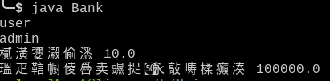
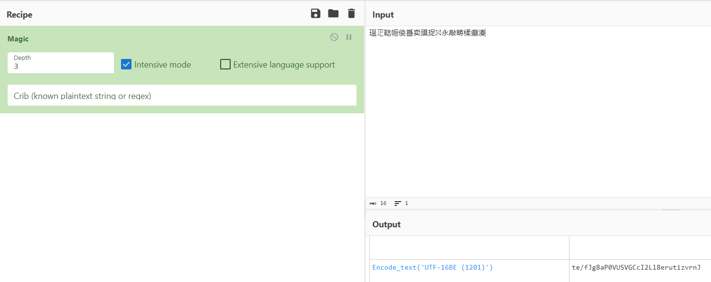
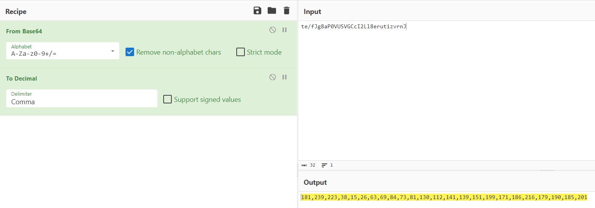
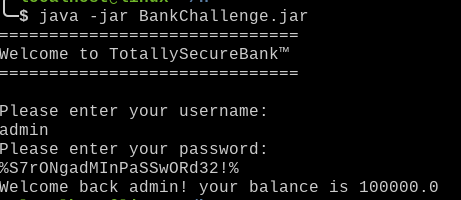

# javac Bank.java a.java







```py
from z3 import *

s = Solver()

n = 24

a = [BitVec(f'a{i}', 8) for i in range(n)]

for i in range(n):
    s.add(a[i] >= 0x20, a[i] <= 0x7f)

var2 = 1

while var2 <= n: 
    var3 = 0

    while var3 < n:
        a[var3] = (a[var3] + (var2 - 12) * var3 + 6)
        var3 += 1

    var2 += 1

l = [181,239,223,38,15,26,63,69,84,73,81,130,112,141,139,151,199,171,186,216,179,190,185,201]

for i in range(n):
    s.add(a[i] == l[i])

print(s.check())

m = s.model()

flag = {}

for i in m.decls():
    flag[i.name()] = m[i].as_long()

w = ''

for i in range(n):
    w += chr(flag[f'a{i}'])

print('uoftctf{' + w + '}')
```

# User -> admin
# Password -> %S7rONgadMInPaSSwORd32!%



# FLAG

**`uoftctf`**


