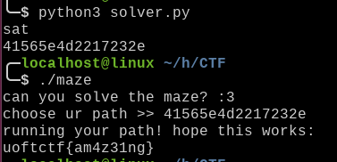

# solver.py

```py
from z3 import *

s = Solver()

n = 8

a = [BitVec(f'a{i}', 8) for i in range(n)]

flag = [0x4f, 0x4e, 0x23, 0x58, 0x7e, 0x6f, 0x38, 0x26]
sums = [0xce, 0xa1, 0xae, 0xad, 0x64, 0x9f, 0xd5]

for i in range(n):
    s.add(a[i] & 3 != 0)
    s.add(a[i] != (3 * (a[i] / 3)) & 0xff)
    s.add(a[i] <= 100)
    s.add(a[i] > 19)
    flag[i] ^= a[i]
    if i > 0:
        s.add(flag[i] + flag[i - 1] == sums[i - 1])

print(s.check())
m = s.model()

w = []

for i in range(n):
    w.append(hex(m[a[i]].as_long())[2:])

print(''.join(w[::-1]))
```





# FLAG

**`uoftctf{am4z31ng}`**


