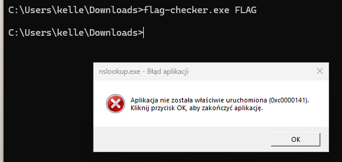

## x64dbg + IDA
---

We are trying to run the application.


The application is asking for 4 characters to be entered.

We are trying with 4 characters; let's see what happens.


Nothing happens.

We will check in IDA what the program is doing.

The program creates an MD5 hash from the provided argument and XORs the memory using this hash.


This array is used in this function; let's check what it does.


It creates some process; I assume it will run a program that has been encoded using the generated hash.


We know that Windows programs start with "MZ," so we will run x64dbg and set a breakpoint at address 0x1400019EB, where the program starts XORing with the hash. We will fetch the first two values from that address and XOR them together.

```log
file flag-checker.exe 
flag-checker.exe: PE32+ executable (console) x86-64, for MS Windows, 6 sections

xxd flag-checker.exe 
00000000: 4d5a 9000 0300 0000 0400 0000 ffff 0000  MZ..............
```

The memory we are interested in is stored in the RSI register. We will go to that address, fetch the first two values, and XOR them together.

```log
hex(0x42 ^ ord('M'))
hex(0x17 ^ ord('Z'))
```

We get '0f4d'. Now that we know the MD5 hash is XORing the memory, we will search for a hash that starts with '0f4d'. We will run a script to help find a hash starting with 
'0f4d' hopefully, we will get lucky.

```py
import itertools
import hashlib

letters = "ABCDEFGHIJKLMNOPQRSTUVWXYZ"
length = 4  

for perm in itertools.product(letters, repeat=length):
    perm_string = ''.join(perm)
    md5_hash = hashlib.md5(perm_string.encode()).hexdigest()
    
    if '0f4d' == md5_hash[:4]:
        print(md5_hash, perm_string)
```
What is the result?

```log
0f4d07c87e2ac3fcbf097bdc8e97e8f0 BGYE
0f4d0db3668dd58cabb9eb409657eaa8 FLAG <- That's interesting.
0f4d5210ee0eba6d699b51edda134dd6 FSHB
0f4deef3f371811029e927a228b77120 GAOO
0f4d47cacf9622dd6861930770a245bc JZCR
0f4df2d6e93525309d302ded9fa12312 MJAJ
0f4de04f97fe83d0fca9813713a8a6e1 NFVD
0f4daba88e4585ffb51e9a63757357ad OKLJ
0f4d0727d96f5da2d6900864ff6f124f SPRM
```

Let's try to run it.



it doesn't work at all

We return to x64dbg and run the program with the argument "FLAG." We go to the address where the MD5 hash XORed the data, and we see that we have decoded the data.


It seems that the challenge doesn't work on my hardware configuration, as I showed earlier.
system 


We don't give up and will try to do this without running the challenge. We already have the decoded code, so now we need to get it and examine it in IDA.

To fetch the data, we know that the XORed memory is in the RSI register, and the number of loop iterations is stored in the RBX register. We can extract the data by accessing memory pointed to by RSI and iterating over it based on the value in RBX.

To get the data, follow these steps in x64dbg:

Set a breakpoint at the loop where the XOR operation happens.
When the breakpoint is hit, inspect the contents of the RSI register (this will give you the memory address where the data is located).
Use the RBX register to determine how many iterations the loop will perform.
Dump the memory content from the RSI address for the number of iterations specified by RBX.
Once you have the data, you can export or copy it and load it into IDA for further analysis.


with this knowledge we can retrieve this memory area using

```log
savedata "C:\\Users\\kelle\\Downloads\\output.bin", 0x1F3CF230830, 0x11400
                                                       ^^^^^^
                                                 this address is changing 
```


We move to IDA and check what we've managed to retrieve.

It's a program that encodes and decodes something. What interests us is in this part of the program.


This function.

```log
sub_140011172((int)Src, (int)v12, (int)Buffer, v4, Buf1, (__int64)Size);
```

It decodes the flag using AES.
As we know, AES requires a key and an initialization vector (IV).


Now, I assume that this function creates the key.

```log
qmemcpy(Src, &unk_14001C310, 0x10uLL);
memset(v12, 0, sizeof(v12));
v3 = j_strlen("0xMikiko");
sub_1400113B6("0xMikiko", v3, Src, 16LL);
```

Let's see what it does.

arg1 = "0xMikiko"
arg2 = j_strlen("0xMikiko")
arg3 = (Src = &unk_14001C310)


arg4 = 16

what can it do???
several functions are run


After a brief analysis, I decided to rewrite it in Python.

```py
l = [ 0x56, 0x07, 0x2D, 0xC7, 0xEB, 0x91, 0x5C, 0xD5, 0xD3, 0x8F, 0xF8, 0x15, 0x4E, 0x4D, 0xB7, 0x8E ]
a1 = [ord(i) for i in "0xMikiko"]
a2 = len(a1)
a3 = [i for i in range(256)]
v6 = 0

for j in range(256):
    v6 = (a1[j % a2] + a3[j] + v6) % 256
    v7 = a3[j]
    a3[j] = a3[v6]
    a3[v6] = v7

v4 = 0
v5 = 0

for i in range(0x10):
    v4 = (v4 + 1) % 256
    v5 = (a3[v4] + v5) % 256
    v7 = a3[v4]
    a3[v4] = a3[v5]
    a3[v5] = v7
    l[i] ^= a3[(a3[v5] + a3[v4]) % 256]

for i in range(0x10):
    print(chr(l[i]), end='')
```

We managed to decode something! :)

## ---------> REVERSE ENGINEER

This could be the key.

We see that what we are sending is being encoded and compared with Buf2.


So, the flag is encoded in Buf2.
We will copy these values and write a Python script to decode them.

```py
from Crypto.Cipher import AES
from Crypto.Util.Padding import pad,unpad

data = bytes([0xB7, 0xA8, 0x36, 0x83, 0xA3, 0x63, 0x5B, 0x70, 0x8D, 0xEF, 0xA8, 0xB7, 0xA5, 0x58, 0x9A, 0x18, 0x56, 0xAC, 0x6F, 0x1F, 0xE3, 0x5F, 0xE3, 0x0E, 0x98, 0xD9, 0xA7, 0x85, 0x51, 0x90, 0x1E, 0x2C, 0xD3, 0x48, 0x43, 0xB8, 0xE2, 0x02, 0xB8, 0x48, 0x4C, 0x52, 0x55, 0x8A, 0x16, 0x2E, 0xBD, 0xDB, 0x10, 0x2A, 0x75, 0xEB, 0x1A, 0xA6, 0x55, 0x90, 0xF0, 0x12, 0xA8, 0xED, 0xD1, 0xD8, 0x70, 0xAB])
key = 'REVERSE ENGINEER'
iv =  'REVERSE ENGINEER'.encode('utf-8') #16 char for AES128

def decrypt(enc,key,iv):
        cipher = AES.new(key.encode('utf-8'), AES.MODE_CBC, iv)
        return unpad(cipher.decrypt(enc),16)

decrypted = decrypt(data,key,iv)
print('data: ', decrypted.decode("utf-8", "ignore"))
```
Success!

```log
data:  wwf{Try_t0_c0mmun1c4t3_by_p1p3_H0p3_Y0u_L1k3_It}
```


