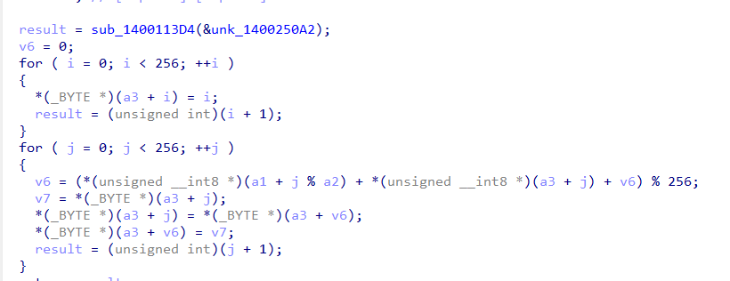

## x64dbg + IDA
---

We are trying to run the application.


The application is asking for 4 characters to be entered.

We are trying with 4 characters; let's see what happens.


Nothing happens.

We will check in IDA what the program is doing.

The program creates an MD5 hash from the provided argument and XORs the memory using this hash.


This array is used in this function; let's check what it does.


It creates some process; I assume it will run a program that has been encoded using the generated hash.


wiemy że programy w windows zaczynają się od MZ, uruchomimy x64dbg i postawimy break point ( 0x1400019EB ) w miejscu gdzie program zaczyna ksorować za pomocą hasza. Pobierzemy dwie pierwsze wartości z pod tego adresu i zrobimy z nimi ksor.

```log
file flag-checker.exe 
flag-checker.exe: PE32+ executable (console) x86-64, for MS Windows, 6 sections

xxd flag-checker.exe 
00000000: 4d5a 9000 0300 0000 0400 0000 ffff 0000  MZ..............
```
pamięć która nas interesuje jest w rsi
przechodzimy pod ten adres i pobieramy dwie pierwsze wartości i je ksorujemy

```log
hex(0x42 ^ ord('M'))
hex(0x17 ^ ord('Z'))
```
otrzymujemy '0f4d'
teraz z koro wiemy że hasz MD5 nam ksoruje pamięć to szukamy hasza który zaczyna się od tego '0f4d'

uruchomimy taki skrypt który pomoże na znaleźć hasz zaczynający się na '0f4d' może będziemy mieli szczęście

```py
import itertools
import hashlib

letters = "ABCDEFGHIJKLMNOPQRSTUVWXYZ"
length = 4  

for perm in itertools.product(letters, repeat=length):
    perm_string = ''.join(perm)
    md5_hash = hashlib.md5(perm_string.encode()).hexdigest()
    
    if '0f4d' == md5_hash[:4]:
        print(md5_hash, perm_string)
```
wynik 

```log
0f4d07c87e2ac3fcbf097bdc8e97e8f0 BGYE
0f4d0db3668dd58cabb9eb409657eaa8 FLAG <- to jest interesujące
0f4d5210ee0eba6d699b51edda134dd6 FSHB
0f4deef3f371811029e927a228b77120 GAOO
0f4d47cacf9622dd6861930770a245bc JZCR
0f4df2d6e93525309d302ded9fa12312 MJAJ
0f4de04f97fe83d0fca9813713a8a6e1 NFVD
0f4daba88e4585ffb51e9a63757357ad OKLJ
0f4d0727d96f5da2d6900864ff6f124f SPRM
```

próbujemy uruchomić 


u nie nie działa

wracamy do x64dbg i uruchamiamy program z argumentem FLAG
przechodzimy pod adres w którym hash MD5 ksorował dane i widzimy że zdekodowaliśmy dane


na moiej konfikuracji sprzętu nie działa to wyzwanie jak już pokazywałem.
system 


nie załamujemy się i próbujemy zrobić to bez uruchamiania wyzwania
mamy już zdekodowany kod to teraz go pobierzemy i obejrzymy w IDA
ale jak go pobrać? 

to jest pętla którz ksoruje nasze dane
widzimy że ksorowana pamięć jest rsi a ilość obrotów pętli jest w rbx


mając taką wiedzę możemy pobrać ten obszar pamięci za pomocą

```log
savedata "C:\\Users\\kelle\\Downloads\\output.bin", 0x1F3CF230830, 0x11400
                                                       ^^^^^^
                                                 ten adres się zmienia 
```

przechodzimy do IDA i srawdzamy co się udało pobrać

jest to program który coś koduje i rozkodowuje
to co nas interesuje jest w tym miejscu programu


ta funkcja 

```log
sub_140011172((int)Src, (int)v12, (int)Buffer, v4, Buf1, (__int64)Size);
```

dekoduje flagę za pomocą AES


a jak wiemy AES potrzebuje key i iv


teraz domyślam się że ta funkcja tworzy key

```log
qmemcpy(Src, &unk_14001C310, 0x10uLL);
memset(v12, 0, sizeof(v12));
v3 = j_strlen("0xMikiko");
sub_1400113B6("0xMikiko", v3, Src, 16LL);
```

zobaczymy co ona robi 

arg1 = "0xMikiko"
arg2 = j_strlen("0xMikiko")
arg3 = (Src = &unk_14001C310)


arg4 = 16

co to może robić???
jest uruchamiane kilka funkcji 




po krótkiej analizie postanowiłem to przepisać na python

```py
l = [ 0x56, 0x07, 0x2D, 0xC7, 0xEB, 0x91, 0x5C, 0xD5, 0xD3, 0x8F, 0xF8, 0x15, 0x4E, 0x4D, 0xB7, 0x8E ]
a1 = [ord(i) for i in "0xMikiko"]
a2 = len(a1)
a3 = [i for i in range(256)]
v6 = 0

for j in range(256):
    v6 = (a1[j % a2] + a3[j] + v6) % 256
    v7 = a3[j]
    a3[j] = a3[v6]
    a3[v6] = v7

v4 = 0
v5 = 0

for i in range(0x10):
    v4 = (v4 + 1) % 256
    v5 = (a3[v4] + v5) % 256
    v7 = a3[v4]
    a3[v4] = a3[v5]
    a3[v5] = v7
    l[i] ^= a3[(a3[v5] + a3[v4]) % 256]

for i in range(0x10):
    print(chr(l[i]), end='')
```

coś nam się udało odkodować :)

## REVERSE ENGINEER

to może być klucz

widzimy że to co przesyłamy jest kodowane i porównywane z Buf2


a więc w Buf2 jest zakodowana flaga 
kopjujemy te wartości i napiszemy skrypt python

```py
from Crypto.Cipher import AES
from Crypto.Util.Padding import pad,unpad

data = bytes([0xB7, 0xA8, 0x36, 0x83, 0xA3, 0x63, 0x5B, 0x70, 0x8D, 0xEF, 0xA8, 0xB7, 0xA5, 0x58, 0x9A, 0x18, 0x56, 0xAC, 0x6F, 0x1F, 0xE3, 0x5F, 0xE3, 0x0E, 0x98, 0xD9, 0xA7, 0x85, 0x51, 0x90, 0x1E, 0x2C, 0xD3, 0x48, 0x43, 0xB8, 0xE2, 0x02, 0xB8, 0x48, 0x4C, 0x52, 0x55, 0x8A, 0x16, 0x2E, 0xBD, 0xDB, 0x10, 0x2A, 0x75, 0xEB, 0x1A, 0xA6, 0x55, 0x90, 0xF0, 0x12, 0xA8, 0xED, 0xD1, 0xD8, 0x70, 0xAB])
key = 'REVERSE ENGINEER'
iv =  'REVERSE ENGINEER'.encode('utf-8') #16 char for AES128

def decrypt(enc,key,iv):
        cipher = AES.new(key.encode('utf-8'), AES.MODE_CBC, iv)
        return unpad(cipher.decrypt(enc),16)

decrypted = decrypt(data,key,iv)
print('data: ', decrypted.decode("utf-8", "ignore"))
```
sukces

```log
data:  wwf{Try_t0_c0mmun1c4t3_by_p1p3_H0p3_Y0u_L1k3_It}
```


