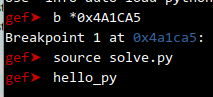
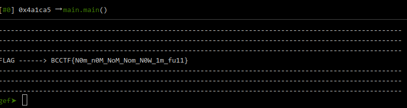

## We set a breakpoint and run the script solve.py





## solve.py

```py

import gdb

class HelloPy(gdb.Command):
    def __init__(self):
        self.offset = 32
        # self.alf = '0123456789abcdefghijklmnopqrstuvwxyzABCDEFGHIJKLMNOPQRSTUVWXYZ_!'
        self.alf = 'N0m_MoW1fun'
        super(HelloPy, self).__init__('hello_py', gdb.COMMAND_USER)


    def invoke(self, _unicode_args, _from_tty):

        l = bytes.fromhex('df7e37fae9835f8ce5a74cfca4b21f846274d39b264308ee3ec776f03acd3eb859b78e7e0286a9a9080b431acc68829532c7b0056b59ce491ed71f1edd86d4ff7b78076b88fdd662220ac6a578ce2cf627925d893d3f53b6bdb6fa297d4afa84d1')

        l = [i for i in l]
        
        # BCCTF{N0m_n0M_NoM_Nom_N0W_1m_fu11}

        w = list('BCCTF{AAAAAAAAAAAAAAAAAAAAAAAAAAA}')

        a = 14

        x = 6

        while a < (len(w) * 2):

            for c in self.alf:
                ww = w
                ww[x] = c
                gdb.execute(f'r <<< {''.join(ww)}')
                for _ in range(x+1):
                    gdb.execute('c')

                address = int(self.read_stack_value(), 16)

                ll = self.read_memory(address)

                if l[:a] == ll[:a]:
                    with open('plik.txt', 'w') as f:
                        f.write(''.join(ww) + str(a))
                    f.close()
                    x += 1
                    a += 2
                    w = ww
                    break

        print('-'*100)
        print('-'*100)
        print('-'*100)
        print(f'FLAG ------> {''.join(w)}')
        print('-'*100)
        print('-'*100)
        print('-'*100)

    # Fetching the current hash from memory
    def read_memory(self, addr, length=68):
        inferior = gdb.inferiors()[0]
        mem = inferior.read_memory(addr, length)
        return [int.from_bytes(i, byteorder='little') for i in mem]
    
    # Fetching the current hash address
    def read_stack_value(self):
        result = gdb.execute(f"x/gx $rsp+{self.offset}", to_string=True)
        return result.split("\n")[0].split()[1]

HelloPy()
```


# FLAG

**`BCCTF{N0m_n0M_NoM_Nom_N0W_1m_fu11}`**


