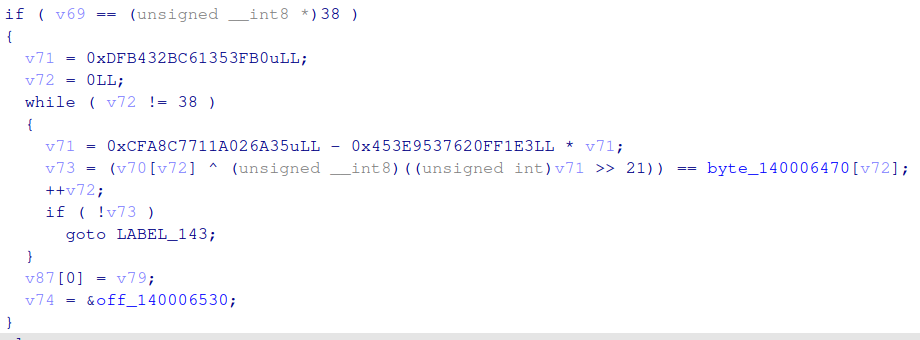

# solver.py




```py
byte_140006470 = [ 0x3A, 0x77, 0x2C, 0xA8, 0x0A, 0x82, 0xD2, 0x7F, 0x55, 0x11, 0x40, 0xB6, 0x62, 0x64, 
                  0x8C, 0x39, 0x4E, 0xDE, 0xCB, 0x8B, 0x91, 0x49, 0x60, 0xA8, 0xF1, 0x2F, 0xBD, 0xE5, 
                  0xE0, 0x7B, 0xDB, 0xDA, 0x7B, 0xD3, 0x33, 0x04, 0x28, 0x9E, 0x0A ]

v71 = 0xDFB432BC61353FB0

for i in range(38):
    v71 = 0xCFA8C7711A026A35 - 0x453E9537620FF1E3 * v71
    for c in range(0x20, 0x7F):
        if (c ^ (v71 >> 21 & 0xff)) == byte_140006470[i]:
            print(chr(c), end='')
            break
print()
```


# FLAG

**`flag{ed817c62d7f7dcdb05c0f6e520a7069e}`**


